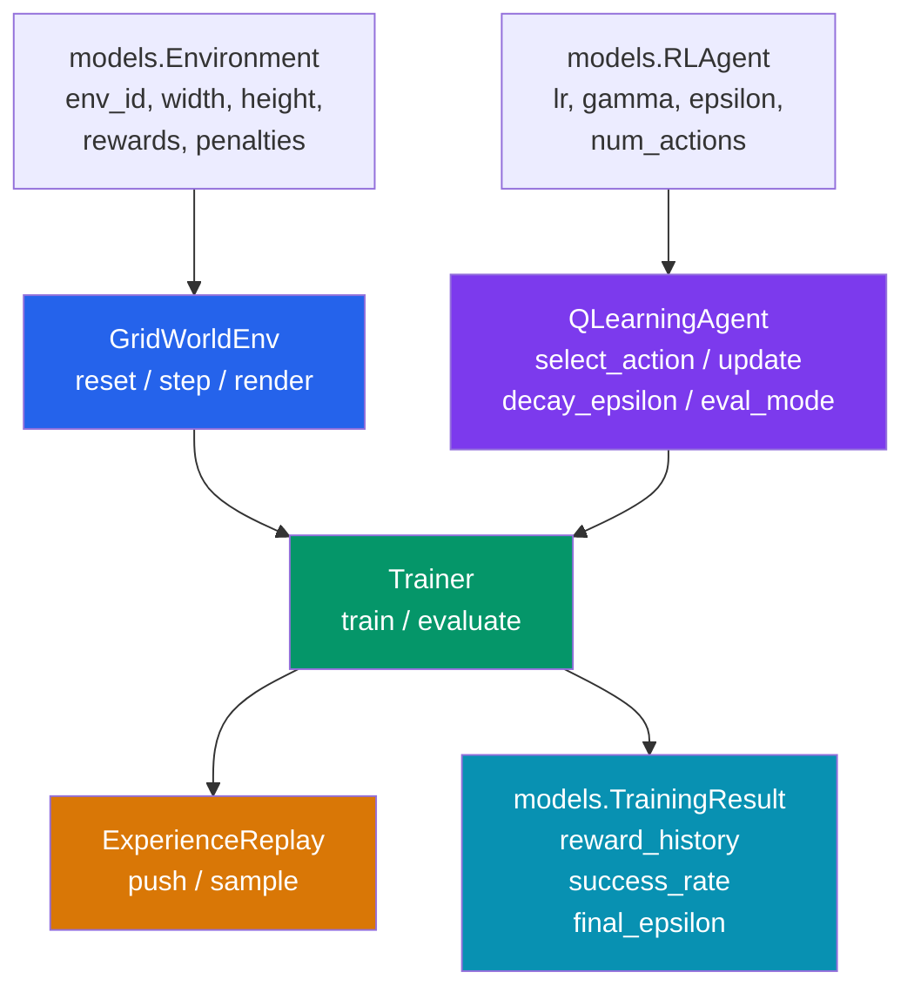

# aumai-openworldrl

> **Experimental research software.** This library is part of the AumAI open-source agentic AI
> infrastructure suite. APIs are unstable and may change without notice between minor versions.
> Not recommended for production use without thorough evaluation.

Tabular Q-learning in open-ended grid environments — a focused, dependency-light foundation for
studying reinforcement learning agent behavior, reward shaping, and exploration strategies.

[](https://github.com/aumai/aumai-openworldrl/actions)
[](LICENSE)
[](https://python.org)

---

## What is this?

Think of a mouse learning to navigate a maze. It starts with no knowledge of the layout, makes
random moves, occasionally bumps into walls, and eventually discovers that moving right and down
tends to lead to food. Each time it reaches the food it updates its internal map of "which moves
are good from which positions." Over thousands of repetitions the mouse stops exploring randomly
and starts exploiting the best path it has learned.

`aumai-openworldrl` encodes exactly this process in clean, auditable Python. The maze is a
configurable 2-D grid. The mouse is a tabular Q-learning agent. The training loop runs episodes,
collects experience, updates the Q-table, and decays exploration over time. The whole system is
roughly 450 lines of strict-typed code with no heavy ML framework dependency.

---

## Why does this matter?

Most reinforcement learning tutorials reach for PyTorch or JAX immediately, burying the core
algorithm under layers of tensor abstractions. Understanding _why_ Q-learning converges — what
the Bellman equation is actually doing, why epsilon decay matters, why discount factors shape
long-horizon behavior — requires seeing the algorithm written in direct arithmetic, not wrapped
in autograd machinery.

This library exists for three audiences:

1. **Researchers** who want a transparent baseline to compare against deep RL variants.
2. **Engineers** building agentic AI systems who need to understand exploration vs. exploitation
   trade-offs before deploying LLM-based agents.
3. **Educators** who want runnable, readable RL code that fits on a single screen.

---

## Architecture



**Data flow during one training episode:**

```
Trainer.train()
  env.reset()  →  initial_state
  loop until done:
    agent.select_action(state)        # epsilon-greedy: random or argmax Q
    env.step(action)                  # (next_state, reward, done, info)
    replay.push(experience)           # circular buffer, capacity=1000
    agent.update(s, a, r, s', done)   # Bellman update → returns TD error
    state = next_state
  agent.decay_epsilon()               # ε ← max(ε_min, ε * ε_decay)
  record episode_reward, success
→  TrainingResult (Pydantic)
```

---

## Features

- **GridWorldEnv** — deterministic 2-D grid with configurable walls, step penalties, wall
  penalties, and goal rewards; fully reproducible with integer seeds; renders as ASCII art.
- **QLearningAgent** — classic tabular Q-learning with epsilon-greedy exploration, TD-error
  return from `update()`, tie-breaking via random selection among equally valued actions, and
  an `eval_mode()` context manager that pins epsilon to zero for clean greedy evaluation without
  permanently modifying agent state.
- **ExperienceReplay** — fixed-capacity circular buffer (`collections.deque`) for storing
  `(state, action, reward, next_state, done)` transitions; supports random mini-batch sampling.
- **Trainer** — orchestrates full training and evaluation loops, emits structured
  `TrainingResult` Pydantic models with per-episode reward history, success rate, and final
  epsilon value.
- **Pydantic v2 models** — all configuration and results are validated at construction time;
  safe to serialize to JSON for experiment logging.
- **Zero heavy dependencies** — only `pydantic` and `click` beyond the standard library.
- **CLI** — two commands (`train`, `evaluate`) with full flag control and JSON output.

---

## Quick Start

### Install

```bash
pip install aumai-openworldrl
# or from source:
git clone https://github.com/aumai/aumai-openworldrl
cd aumai-openworldrl
pip install -e ".[dev]"
```

### Python API — train an agent in five lines

```python
from aumai_openworldrl.core import Trainer
from aumai_openworldrl.models import Environment, RLAgent

env_config   = Environment(env_id="my_maze", width=8, height=8, max_steps=300)
agent_config = RLAgent(agent_id="q1", learning_rate=0.1, discount_factor=0.99)

trainer = Trainer(env_config, agent_config, seed=42)
result  = trainer.train(episodes=2000)

print(f"Success rate: {result.success_rate:.1%}")
print(f"Mean reward (last 100 episodes): {result.mean_reward:.4f}")
```

### CLI — train and save results

```bash
aumai-openworldrl train \
  --episodes 2000 \
  --width 8 \
  --height 8 \
  --lr 0.1 \
  --gamma 0.99 \
  --epsilon-decay 0.995 \
  --seed 42 \
  --output results.json
```

### CLI — evaluate a pre-trained agent with grid rendering

```bash
aumai-openworldrl evaluate \
  --train-episodes 1000 \
  --episodes 100 \
  --seed 42 \
  --render
```

---

## CLI Reference

### `aumai-openworldrl train`

Train a tabular Q-learning agent on a grid world.

| Flag | Default | Description |
|------|---------|-------------|
| `--episodes` | 1000 | Number of training episodes |
| `--width` | 5 | Grid width in cells |
| `--height` | 5 | Grid height in cells |
| `--max-steps` | 200 | Maximum steps per episode before forced termination |
| `--lr` | 0.1 | Q-learning learning rate (alpha) |
| `--gamma` | 0.99 | Discount factor for future rewards |
| `--epsilon-decay` | 0.995 | Multiplicative epsilon decay per episode |
| `--seed` | None | Random seed for reproducibility |
| `--output` | `training_result.json` | Path to write JSON results |

**Example — large grid, longer exploration horizon:**

```bash
aumai-openworldrl train \
  --episodes 5000 \
  --width 12 \
  --height 12 \
  --max-steps 400 \
  --epsilon-decay 0.998 \
  --seed 7 \
  --output large_grid_run.json
```

**Stdout summary:**

```
Training Q-learning agent: 5000 episodes on 12x12 grid (seed=7)

Training complete:
  Total episodes  : 5000
  Total steps     : 847231
  Mean reward     : 0.7843
  Best reward     : 0.8200
  Success rate    : 72.1%
  Final epsilon   : 0.0821

Result saved to large_grid_run.json
```

---

### `aumai-openworldrl evaluate`

Pre-train for N episodes, then run greedy evaluation (epsilon forced to 0).

| Flag | Default | Description |
|------|---------|-------------|
| `--episodes` | 100 | Number of evaluation episodes |
| `--width` | 5 | Grid width |
| `--height` | 5 | Grid height |
| `--train-episodes` | 500 | Pre-training episodes run before evaluation begins |
| `--seed` | 42 | Random seed |
| `--render` | False | Print ASCII grid for the first evaluation episode |

**Example with rendering:**

```bash
aumai-openworldrl evaluate \
  --train-episodes 2000 \
  --episodes 200 \
  --width 7 \
  --height 7 \
  --seed 13 \
  --render
```

**With `--render`, each step of the first episode prints the grid:**

```
. . . . . . .
. # . . # . .
. . . A . . .
. . # . . # .
. . . . . . .
. . # . # . .
. . . . . . G
```

_(A = agent, G = goal, # = wall, . = open cell)_

---

## Python API Examples

### Custom reward shaping

```python
from aumai_openworldrl.models import Environment

# Penalize wall collisions heavily, give big goal reward
env_config = Environment(
    env_id="shaped",
    width=6,
    height=6,
    max_steps=200,
    goal_reward=5.0,    # large positive reward at goal
    step_penalty=-0.02, # small penalty every step (encourages shorter paths)
    wall_penalty=-0.5,  # heavy penalty for bumping walls
)
```

### Greedy evaluation with eval_mode context manager

```python
from aumai_openworldrl.core import GridWorldEnv, QLearningAgent
from aumai_openworldrl.models import Environment, RLAgent

env_config   = Environment(env_id="e1", width=5, height=5)
agent_config = RLAgent(agent_id="a1", num_actions=4)

env   = GridWorldEnv(env_config, seed=0)
agent = QLearningAgent(agent_config, seed=0)

# eval_mode sets epsilon=0.0 for the duration of the with-block,
# then restores the original epsilon unconditionally via try/finally.
with agent.eval_mode():
    state = env.reset()
    done  = False
    while not done:
        action = agent.select_action(state)   # always greedy inside eval_mode
        state, reward, done, info = env.step(action)
    print("Reached goal:", info["reached_goal"])
```

### Accessing the experience replay buffer directly

```python
from aumai_openworldrl.core import ExperienceReplay
from aumai_openworldrl.models import Experience

buffer = ExperienceReplay(capacity=5000)

buffer.push(Experience(state=(0, 0), action=1, reward=-0.01, next_state=(0, 1), done=False))
buffer.push(Experience(state=(0, 1), action=2, reward=-0.01, next_state=(1, 1), done=False))
buffer.push(Experience(state=(1, 1), action=1, reward=1.0,   next_state=(1, 2), done=True))

print(f"Buffer size: {len(buffer)}")
batch = buffer.sample(2)
for exp in batch:
    print(f"  s={exp.state}  a={exp.action}  r={exp.reward}  done={exp.done}")
```

### Serializing and reloading a TrainingResult

```python
import json
from aumai_openworldrl.core import Trainer
from aumai_openworldrl.models import Environment, RLAgent, TrainingResult

trainer = Trainer(
    Environment(env_id="g", width=5, height=5),
    RLAgent(agent_id="q"),
    seed=0,
)
result = trainer.train(episodes=1000)

# Save to JSON
json_str = result.model_dump_json(indent=2)
with open("run.json", "w") as f:
    f.write(json_str)

# Reload and inspect
loaded = TrainingResult.model_validate_json(json_str)
print(f"Loaded result: success_rate={loaded.success_rate:.1%}")
print(f"Reward history length: {len(loaded.reward_history)}")
```

---

## Configuration Reference

### `Environment`

| Field | Type | Default | Constraints | Description |
|-------|------|---------|-------------|-------------|
| `env_id` | `str` | required | — | Unique identifier for the environment instance |
| `name` | `str` | `"GridWorld"` | — | Human-readable display name |
| `width` | `int` | 5 | `> 0` | Number of columns in the grid |
| `height` | `int` | 5 | `> 0` | Number of rows in the grid |
| `num_actions` | `int` | 4 | `> 0` | Discrete action count (0=up, 1=right, 2=down, 3=left) |
| `max_steps` | `int` | 200 | `> 0` | Episode terminates after this many steps |
| `goal_reward` | `float` | 1.0 | — | Reward added when agent reaches `(height-1, width-1)` |
| `step_penalty` | `float` | -0.01 | — | Reward applied every non-terminal step |
| `wall_penalty` | `float` | -0.05 | — | Reward applied when movement into wall or boundary is attempted |

### `RLAgent`

| Field | Type | Default | Constraints | Description |
|-------|------|---------|-------------|-------------|
| `agent_id` | `str` | required | — | Unique identifier |
| `algorithm` | `str` | `"q_learning"` | — | Algorithm name tag |
| `learning_rate` | `float` | 0.1 | `(0, 1]` | Alpha in the Bellman update |
| `discount_factor` | `float` | 0.99 | `[0, 1]` | Gamma — weight on future rewards |
| `epsilon` | `float` | 1.0 | `[0, 1]` | Initial exploration probability |
| `epsilon_min` | `float` | 0.01 | `[0, 1]` | Floor for epsilon after decay |
| `epsilon_decay` | `float` | 0.995 | `(0, 1]` | Per-episode multiplicative decay factor |
| `num_actions` | `int` | 4 | `> 0` | Must match the environment's action space size |

---

## How It Works: Deep Dive

### The Q-learning update rule

At each time step the agent observes state `s`, takes action `a`, receives reward `r`, and
transitions to next state `s'`. The Q-table is updated by the Bellman equation:

```
Q(s, a) <- Q(s, a) + alpha * [r + gamma * max_{a'} Q(s', a') - Q(s, a)]
```

The term in brackets is the **TD error** (temporal difference error): the difference between
the current Q-value estimate and the bootstrapped target. When `done=True`, the target simplifies
to just `r` because there is no future state to bootstrap from.

The `update()` method returns this TD error, which can be used to diagnose convergence.

### Epsilon-greedy exploration

With probability `epsilon` the agent picks a uniformly random action. With probability
`1 - epsilon` it picks the action with the highest Q-value. Ties in Q-values are broken by
random choice among all tied actions, which matters for symmetric mazes.

### The eval_mode context manager

`eval_mode()` temporarily sets epsilon to 0.0 and restores the original value on exit via
`try/finally`. This ensures the agent's exploration rate is never permanently corrupted by an
exception during evaluation. Pydantic immutability is respected via `model_copy(update=...)`.

### Experience replay

The `ExperienceReplay` buffer uses `collections.deque(maxlen=capacity)` for O(1) append and
automatic eviction of the oldest transitions when capacity is reached. Sampling is currently
without-replacement when the buffer is larger than the requested batch size.

---

## Integration with Other AumAI Projects

| Project | Integration Point |
|---------|------------------|
| `aumai-specs` | Type annotation and validation conventions; `TrainingResult` conforms to the specs contract model |
| `aumai-autokernel` | Can optimize numerical kernels if Q-table operations are extended to vectorized batch updates |
| `aumai-omnipercept` | Future: replace `(row, col)` state tuples with multimodal feature vectors for vision-based RL |

---

## Contributing

Contributions are welcome. Please read `CONTRIBUTING.md` in the repository root before opening
a pull request.

Key conventions:

- Python 3.11+, strict mypy, ruff linting (run `make lint` to verify).
- All new features require accompanying pytest tests (run `make test`).
- Pydantic models for all data boundaries; no raw dicts crossing module interfaces.
- Conventional commit messages: `feat:`, `fix:`, `refactor:`, `docs:`, `test:`, `chore:`.

---

## License

Apache License 2.0. See `LICENSE` for full text.

Copyright (c) 2025 AumAI Contributors.
